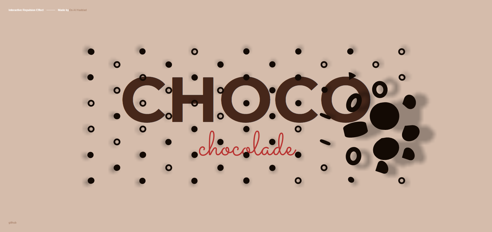

# Interactive 3D Mesh Project 🎨✨

This repository contains a demo project showcasing an **Interactive 3D Mesh** built using **Three.js**. Developed as an experimental web experience, this project explores the potential of interactive 3D elements on the web, allowing users to engage with a dynamic, textured mesh that responds to user input, creating a captivating visual experience that extends beyond traditional 2D design.

### About
The **Interactive 3D Mesh** demo demonstrates the capabilities of Three.js in creating lifelike, responsive 3D models. With interactivity at its core, this project reacts to user movements, offering a tactile experience that highlights the power of 3D graphics in enhancing web content. This project is ideal for designers and developers interested in integrating 3D graphics into web environments, and serves as a model for incorporating interactive elements into any website or app.



### Live Link
View the live demo:
[Live: Interactive 3D Mesh Project](**LinkHere**)


### Getting Started
#### Prerequisites
- **Node.js**: Download and install Node.js from [https://nodejs.org/en/download/](https://nodejs.org/en/download/).

#### Installation
1. Clone or download this repository.
2. Open the project folder in **VS Code** or your preferred editor.
3. Open the terminal within the editor and install dependencies:

    ```bash
    npm install
    ```

#### Running the Project
To run the project locally:
1. Run the following command in the terminal:

    ```bash
    npm run dev
    ```

2. Open your browser and go to `localhost:8080` to view the demo.

### Notes
If you enjoy the project or find it useful, please consider giving it a ⭐ on GitHub. Your support helps inspire further development and sharing of creative code!
